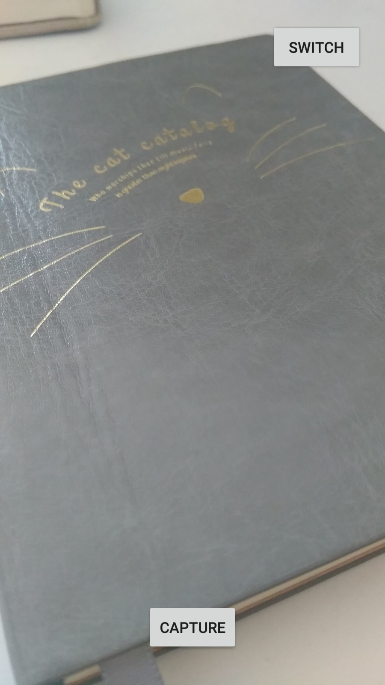

# CameraApi

Camera Api (Media Recorder) - 2020 (Java) (Android)

Media Recorder Implementation with Camera Api

## Why Camera Api?

In my case Camera Api is more reliable than Camera Api 2. That's why I am using Camera Api instead of Camera Api2.

Why?</small>
<ul>
	<li>https://stackoverflow.com/a/49077964</li>
	<li>https://stackoverflow.com/a/49817318</li>
</ul>

## Features
<ul>
	<li>Switch between back and front camera</li>
	<li>Optimal capture size and preview size</li>
  <li>Support portrait and landspace mode</li>
</ul>

## Sources
<ul>
  <li>https://github.com/googlearchive/android-MediaRecorder</li>
  <li>https://github.com/android/media-samples/tree/master/MediaRecorder</li>
  <li>https://developer.android.com/guide/topics/media/camera</li>
</ul>
